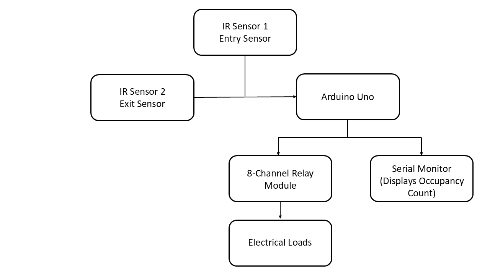
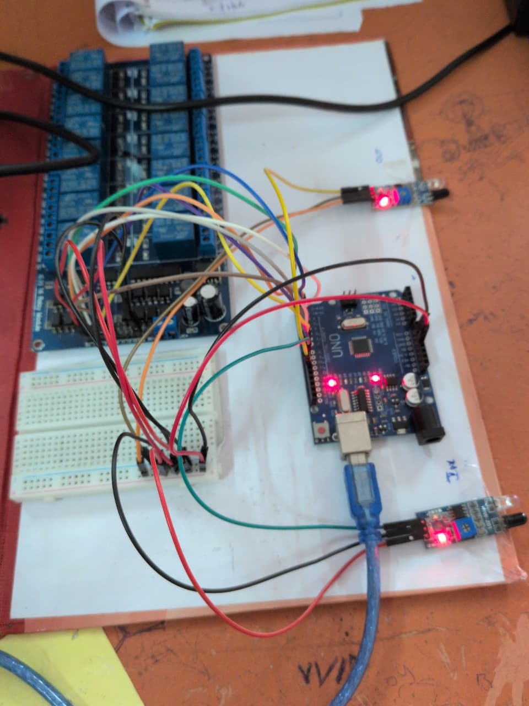
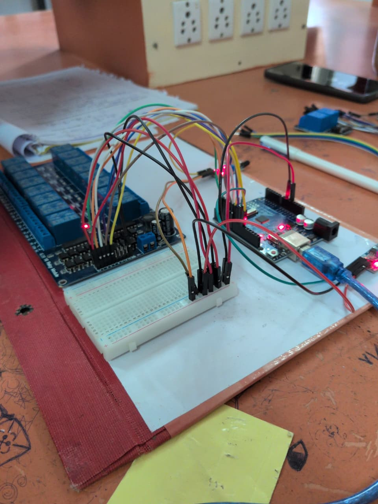
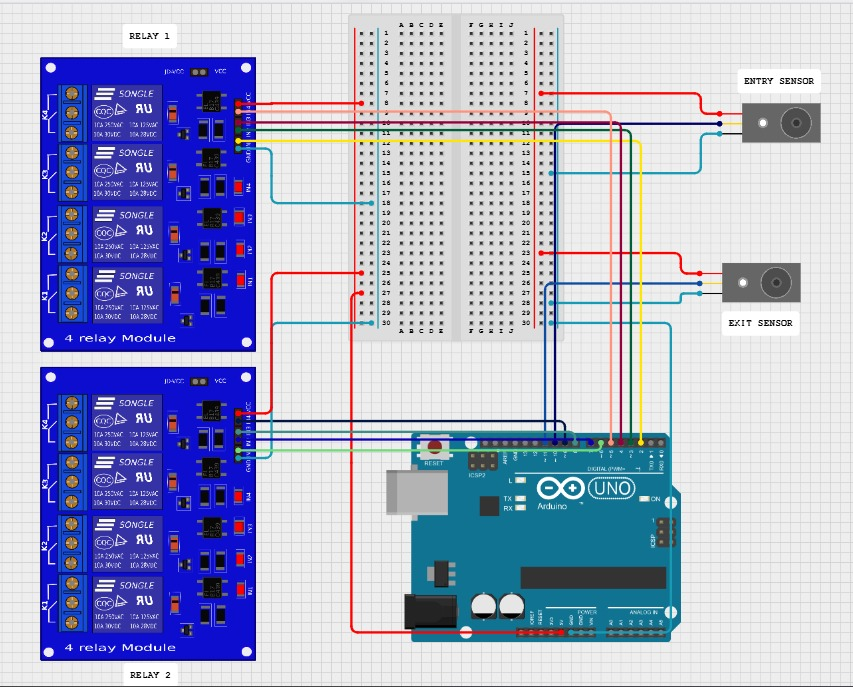

# Real-Time Occupancy Detection System

## Project Overview

The **Real-Time Occupancy Detection System** is an Arduino Uno-based embedded system designed to monitor the number of people entering and exiting a room using two Infrared (IR) sensors. The Arduino Uno maintains a real-time occupancy count based on the signals received from the sensors and displays the count on the Serial Monitor. An 8-channel relay module is controlled according to the occupancy count, demonstrating how electrical loads can be automated based on room occupancy. This project provides a simple, reliable, and cost-effective solution for occupancy monitoring and automation in homes, offices, classrooms, and other indoor environments.

---

## Problem Statement

In homes, offices, classrooms, and other indoor environments, electrical appliances such as lights and fans are often left switched on even when rooms are unoccupied. This results in unnecessary energy consumption, increased electricity costs, and reduced energy efficiency. An automated occupancy detection system that accurately tracks the number of people inside a room can help address this issue by controlling electrical appliances based on real-time occupancy.

---

## Objectives

- Detect people entering and exiting a room using two IR sensors.
- Maintain a real-time occupancy count.
- Control an 8-channel relay module based on the occupancy count.
- Display occupancy information on the Serial Monitor.
- Develop a simple, reliable, and low-cost occupancy detection system.

---

## Hardware Requirements

- Arduino Uno
- 2 × IR Sensors
- 8-Channel Relay Module
- Breadboard
- Jumper Wires
- USB Cable

---

## Software Requirements

- Arduino IDE
- Arduino C++
- Cirkit Designer

---

## Working Principle

The system uses two Infrared (IR) sensors placed at the entry and exit points of a room. The IN sensor detects people entering the room, while the OUT sensor detects people leaving.

Whenever the IN sensor is triggered, the Arduino Uno increments the occupancy count. When the OUT sensor is triggered, the occupancy count is decremented. The updated occupancy count is displayed on the Serial Monitor.

Based on the occupancy count, the Arduino controls an 8-channel relay module. As the occupancy count increases, additional relays are activated. When the occupancy count decreases, the corresponding relays are turned off. This process continuously monitors room occupancy and demonstrates occupancy-based control of electrical loads.

---

## System Operation

| Occupancy Count | Relay Status |
|-----------------|--------------|
| 0 | All relays OFF |
| 1 | Relay 1 ON |
| 2 | Relay 1–2 ON |
| 3 | Relay 1–3 ON |
| ... | ... |
| 8 | All relays ON |

---

## Block Diagram

The block diagram shows the overall working of the occupancy detection system. Two IR sensors detect entry and exit events and send signals to the Arduino Uno. The Arduino updates the occupancy count, displays it on the Serial Monitor, and controls an 8-channel relay module. The relay module can be used to operate electrical loads based on the current occupancy count.

---

## Hardware Prototype

The following images show the hardware implementation of the proposed Real-Time Occupancy Detection System. The prototype consists of an Arduino Uno, two IR sensors for entry and exit detection, an 8-channel relay module, a breadboard for power distribution, and jumper wires for interconnections. The Arduino processes the sensor inputs in real time and controls the relay module according to the occupancy count.

### Hardware Prototype – Front View

### Hardware Prototype – Angled View

---

## Circuit Diagram

The circuit diagram below shows the hardware connections between the Arduino Uno, IR sensors, relay module, and supporting components.

---

## Circuit Simulation

The circuit was simulated using **Cirkit Designer** to verify the hardware connections and system functionality before physical implementation.

**Simulation:** [View Circuit Simulation](https://app.cirkitdesigner.com/project/926a4628-ceb8-4e68-9d71-fafaaf0cb161)

---

## Source Code

The complete Arduino source code for this project is available in the repository.

**Source File:**

- `Occupancy_Detection.ino`

The program reads input from the Entry and Exit IR sensors, maintains the real-time occupancy count, controls the 8-channel relay module based on the occupancy count, and displays occupancy information on the Arduino Serial Monitor.

---

## Applications

- Smart homes
- Offices and workplaces
- Classrooms
- Conference rooms
- Libraries
- Commercial buildings
- Building automation systems

---

## Future Scope

- Integration with IoT platforms for remote monitoring.
- Cloud-based occupancy monitoring and data logging.
- Mobile application for occupancy monitoring and control.
- Multi-room occupancy detection using multiple sensor pairs.
- Integration with security and access control systems.

---

## Author

**Sucharita Sai Palli** 
24BES7051 
B.Tech in Electronics and Communication Engineering 
VIT-AP University
